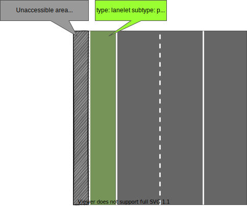
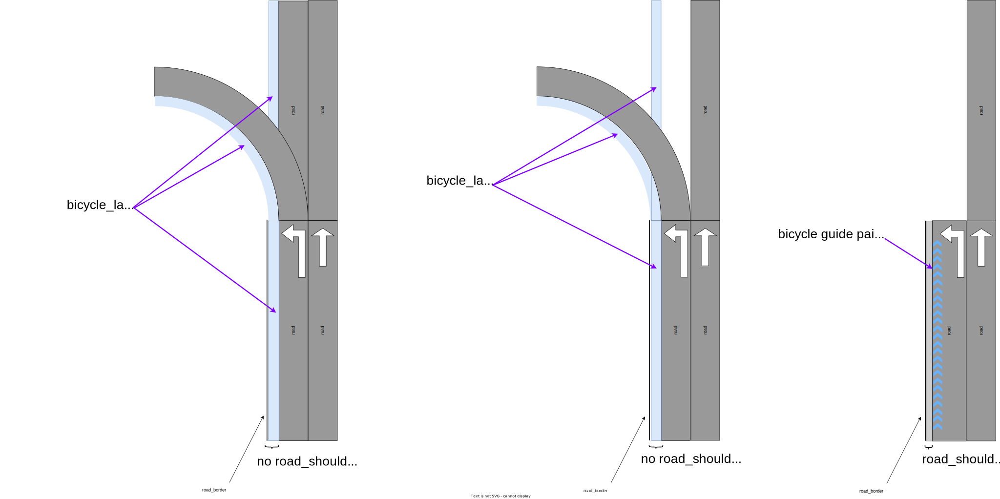

# Extra Lanelet Subtypes

## Roadside Lane

The subtypes for this lanelet classify the outer lanes adjacent to the driving lane.Since the list of lanelet subtypes defined in this [link](https://github.com/fzi-forschungszentrum-informatik/Lanelet2/blob/master/lanelet2_core/doc/LaneletAndAreaTagging.md) cannot represent the shoulder lane and pedestrian lane described below, two new subtypes are defined.When parking on the street, it is necessary to distinguish between a shoulder lane which can be used by vehicles, and a pedestrian lane which can be used by pedestrians and bicycles.If you park in a shoulder lane, you can use the entire lane for temporary parking, but if you park in a pedestrian lane, you must leave a space of at least 75cm.

### Road shoulder subtype

- refers: lanelet with subtype attribute. Subtype explains what the type of roadside it represents. If there is an area outside of this roadside lane that is open to traffic, such as a sidewalk or bike lane, select the road_shoulder subtype.


Sample road shoulder in .osm format is shown below:

```xml
  <relation id="120700">
    <member type="way" role="left" ref="34577"/>
    <member type="way" role="right" ref="120694"/>
    <tag k="type" v="lanelet"/>
    <tag k="subtype" v="road_shoulder"/>
    <tag k="speed_limit" v="10"/>
    <tag k="location" v="urban"/>
    <tag k="one_way" v="yes"/>
  </relation>
```

### Pedestrian lane subtype

- refers: lanelet with subtype attribute. Subtype explains what the type of roadside it represents. If there are no passable areas outside of this roadside lane, select the pedestrian_lane subtype.



Sample pedestrian lane in .osm format is shown below:

```xml
  <relation id="120700">
    <member type="way" role="left" ref="34577"/>
    <member type="way" role="right" ref="120694"/>
    <tag k="type" v="lanelet"/>
    <tag k="subtype" v="pedestrian_lane"/>
    <tag k="speed_limit" v="10"/>
    <tag k="location" v="urban"/>
    <tag k="one_way" v="yes"/>
  </relation>
```

## Bicycle Lane (format_version >= 2)

Although `bicycle_lane` subtype is already defined in the original [Lanelet2 documentation](https://github.com/fzi-forschungszentrum-informatik/Lanelet2/blob/master/lanelet2_core/doc/LaneletAndAreaTagging.md#subtype-and-location), Autoware compatible with `format_version>=2` supports `bicycle_lane` at component level.

In Autoware, `bicycle_lane` is used to identify paths dedicated to cyclists. These lanes can assist in predicting the future paths of bicycles and indicate lanes that Autoware vehicles should avoid or keep clear of.

- specification:
  - `road` lanelet adjacent to the objective `bicycle_lane` should share the same boundary LineString
  - A `bicycle_lane` is connected to/from only `bicycle_lane` lanelets and is adjacent to a `road` lanelet. Namely in Left(Right) hand side traffic rules, it is on the left(right) side of `road` lanelet.
- Although pullover on `bicycle_lane` is normally prohibited by the law, it is allowed to place a `road_shoulder` adjacent to a `bicycle_lane`. However the autoware implementation may not fully support appropriate behavior in such cases.
- The treatment of _bicycle guide painting_, or the shift-arrow shaped painting on the side of the road without explicit separating line, is open to discussion. We can either identity them as part of the vehicle road or separate them as distinct bicycle lanes.



Sample bicycle lane in .osm format is shown below:

```xml
  <relation id="3025302">
    <member type="way" role="left" ref="3025301"/>
    <member type="way" role="right" ref="3025111"/>
    <tag k="type" v="lanelet"/>
    <tag k="subtype" v="bicycle_lane"/>
    <tag k="speed_limit" v="10"/>
    <tag k="location" v="urban"/>
    <tag k="one_way" v="yes"/>
  </relation>
```
