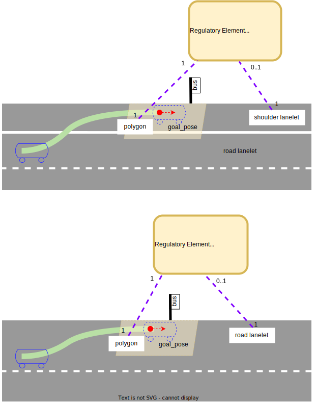

# Extra Regulatory Elements

## Right Of Way

Users must add `right_of_way` tag to intersection lanes, namely lanes with `turn_direction` attribute. Below image illustrates how to set yield lanes(orange) for the ego lane(blue).


Basically intersection lanes which are:

- left/right turn
- straight and on the side of priority sign

need this tag to know which lanes in their `conflicting lanes` can be ignored for object detection.

left/right turning lane is often conflicting with lanes whose traffic lights are red when its traffic light is green, so **at least** those lanes should be registered as yield lanes.

If ego car is going straight the intersection when the traffic light is green, then it does not need to care other lanes because it has the highest priority. But if the traffic lights do not exist and ego lane is on the side of priority road, then yield lanes should be set to explicitly ignore part of conflicting lanes.

## Detection Area

This regulatory element specifies region of interest which vehicle must pay attention whenever it is driving along the associated lanelet. When there are any obstacle in the detection area, vehicle must stop at specified stopline.

- refers: refers to detection area polygon. There could be multiple detection areas registered to a single regulatory element.
- ref_line: refers to stop line of the detection area


Sample detection area in .osm format is shown below:

```xml
  <node id=1 version='1' lat='49.00541994701' lon='8.41565013855'>
    <tag k=’ele’ v=’0’/>
  </node>
  <node id=2 version='1' lat='49.00542091657' lon='8.4156469497'>
    <tag k=’ele’ v=’0’/>
  </node>
  <node id=3 version='1' lat='49.00542180052' lon='8.41564400223'>
    <tag k=’ele’ v=’0’/>
  </node>
  <node id=4 version='1' lat='49.00541994701' lon='8.41564400223'>
    <tag k=’ele’ v=’0’/>
  </node>
  <node id=5 version='1' lat='49.00542180052' lon='8.41564400223'>
    <tag k=’ele’ v=’0’/>
  </node>
  <node id=6 version='1' lat='49.00541994701' lon='8.41564400223'>
    <tag k=’ele’ v=’0’/>
  </node>
  <way id=11 version='1'>
    <nd ref=1 />
    <nd ref=2 />
    <nd ref=3 />
    <nd ref=4 />
    <nd ref=1 />
    <tag k='type' v=’detection_area’ />
    <tag k='area' v=’yes’ />
  </way>
  <way id=12 version="1">
    <nd ref=5 />
    <nd ref=6 />
    <tag k='type' v=stop_line’ />
  </way>
  <relation id="13">
     <tag k="type" v="regulatory_element"/>
     <tag k="subtype" v="detection_area"/>
     <member type="way" ref="11" role="refers"/>
     <member type="way" ref="12" role="ref_line"/>
   </relation>
```

## Road Marking

This regulatory element specifies related road markings to a lanelet as shown below.

\* Note that the stopline in the image is for stoplines that are for reference, and normal stoplines should be expressed using TrafficSign regulatory element.

refers: linestring with type attribute. Type explains what road marking it represents (e.g. stopline).


## Speed Bump

This regulatory element specifies a speed bump on the road.

- refers: to a speed bump polygon. There must be only one speed bump polygon registered to a single
  regulatory element.


An example annotation of speed_bump:

```xml
  <node id='1' lat='40.81478464668' lon='29.35984444811'>
    <tag k='ele' v='3.004897' />
    <tag k='x' v='138.2702' />
    <tag k='y' v='326.5387' />
  </node>
  <node id='2' lat='40.81476705154' lon='29.3599302694'>
    <tag k='ele' v='2.949194' />
    <tag k='x' v='145.5616' />
    <tag k='y' v='324.7803' />
  </node>
  <node id='3' lat='40.81477166944' lon='29.35993194259'>
    <tag k='ele' v='2.948368' />
    <tag k='x' v='145.6889' />
    <tag k='y' v='325.2968' />
  </node>
  <node id='4' lat='40.81478914798' lon='29.35984590876'>
    <tag k='ele' v='3.018582' />
    <tag k='x' v='138.3799' />
    <tag k='y' v='327.0417' />
  </node>
  <way id='5'>
    <nd ref='1' />
    <nd ref='2' />
    <nd ref='3' />
    <nd ref='4' />
    <tag k='area' v='yes' />
    <tag k='height' v='0.15' />
    <tag k='type' v='speed_bump' />
  </way>
  <relation id='6'>
    <member type='way' ref='5' role='refers' />
    <tag k='subtype' v='speed_bump' />
    <tag k='type' v='regulatory_element' />
  </relation>
  <relation id='7'>
    <member type='relation' ref='6' role='regulatory_element' />
    <member type='way' ref='10' role='left' />
    <member type='way' ref='11' role='right' />
    <tag k='location' v='urban' />
    <tag k='participant:vehicle' v='yes' />
    <tag k='speed_limit' v='30.00' />
    <tag k='subtype' v='road' />
    <tag k='type' v='lanelet' />
  </relation>
  <relation id='8'>
    <member type='relation' ref='6' role='regulatory_element' />
    <member type='way' ref='12' role='left' />
    <member type='way' ref='10' role='right' />
    <tag k='location' v='urban' />
    <tag k='participant:vehicle' v='yes' />
    <tag k='speed_limit' v='30.00' />
    <tag k='subtype' v='road' />
    <tag k='type' v='lanelet' />
  </relation>
```

- As an option `slow_down_speed` tag can be added to the speed bump way annotation to override the
  speed calculated in planning module wrt the speed bump `height`. The value specified in
  `slow_down_speed` tag must be in **kph**. So if this option is used then the way annotation should
  look like as below:

```xml
  <way id='5'>
    <nd ref='1' />
    <nd ref='2' />
    <nd ref='3' />
    <nd ref='4' />
    <tag k='area' v='yes' />
    <tag k='height' v='0.15' />
    <tag k='slow_down_speed' v='7.0' />
    <tag k='type' v='speed_bump' />
  </way>
```

## Crosswalk

Original Lanelet2 format only requires `subtype=crosswalk` tag to be specified in the corresponding lanelet. However, Autoware requires a regulatory element to be defined on top of that in order to:

- explicitly define the relevant driving lanes even in 3D environment
- optionally define stop lines associated with the crosswalk
- enable accurate definition of complex polygons for crosswalk

For the details, refer to this [GitHub discussion](https://github.com/orgs/autowarefoundation/discussions/3036).
Crosswalk regulatory element can be tied to `ref_line`, `crosswalk_polygon` and `refers`.


- `ref_line`: Stop line for the crosswalk.
- `crosswalk_polygon`: Accurate area of the crosswalk.
- `refers`: Lanelet that indicates the moving direction of crosswalk users.

_An example:_

```xml
<relation id="10751">
  <member type="way" role="ref_line" ref="8123"/>
  <member type="way" role="crosswalk_polygon" ref="4047"/>
  <member type="relation" role="refers" ref="2206"/>
  <tag k="type" v="regulatory_element"/>
  <tag k="subtype" v="crosswalk"/>
</relation>
```

### Traffic Lights for Crosswalks

It can define not only traffic lights for vehicles but also for crosswalk users by using regulatory element. In this case, the crosswalk lanelet needs to refer the traffic light regulatory element.


_An example:_

```xml
<way id="179745">
  <nd ref="179743"/>
  <nd ref="179744"/>
  <tag k="type" v="traffic_light"/>
  <tag k="subtype" v="solid"/>
  <tag k="height" v="0.5"/>
</way>

...

<relation id="179750">
  <member type="way" role="refers" ref="179745"/>
  <member type="way" role="refers" ref="179756"/>
  <tag k="type" v="regulatory_element"/>
  <tag k="subtype" v="traffic_light"/>
</relation>

...

<relation id="1556">
  <member type="way" role="left" ref="1449"/>
  <member type="way" role="right" ref="1450"/>
  <member type="relation" role="regulatory_element" ref="179750"/>
  <tag k="type" v="lanelet"/>
  <tag k="subtype" v="crosswalk"/>
  <tag k="speed_limit" v="10"/>
  <tag k="location" v="urban"/>
  <tag k="one_way" v="no"/>
  <tag k="participant:pedestrian" v="yes"/>
</relation>
```

### Safety Slow Down for Crosswalks

If you wish ego vehicle to slow down to a certain speed from a certain distance while passing over a
certain crosswalk _even though there are no target objects around it_, you can add following tags to
the crosswalk definition on lanelet2 map:

- `safety_slow_down_speed` **[m/s]**: The speed you want ego vehicle to drive at while passing over
  the crosswalk
- `safety_slow_down_distance` **[m]**: The distance between front bumper of ego vehicle and
  closest point to the crosswalk when ego vehicle slows down and drives at specified speed

_An example:_

```xml
<relation id='34378' visible='true' version='1'>
  <member type='way' ref='34374' role='left' />
  <member type='way' ref='34377' role='right' />
  <tag k='subtype' v='crosswalk' />
  <tag k='safety_slow_down_speed' v='3.0' />
  <tag k='safety_slow_down_distance' v='2.0' />
  <tag k='type' v='lanelet' />
</relation>
```

## No Stopping Area

The area with `no_stopping_area` tag can be used to prohibit even a few seconds of stopping, even for traffic jams or at traffic lights.
The ref_line can be set arbitrarily, and the ego-vehicle should stop at this line if it cannot pass through the area.

_An example:_

```xml
  <way id='9853' visible='true' version='1'>
    <nd ref='9849' />
    <nd ref='9850' />
    <nd ref='9851' />
    <nd ref='9852' />
    <tag k='area' v='yes' />
    <tag k='type' v='no_stopping_area' />
  </way>

  <relation id='9854' visible='true' version='1'>
    <member type='way' ref='9853' role='refers' />
    <member type='way' ref='9848' role='ref_line' />
    <tag k='subtype' v='no_stopping_area' />
    <tag k='type' v='regulatory_element' />
  </relation>
```

## No Parking Area

The area with `no_parking_area` tag can be used to prohibit parking. Stopping for a few seconds is allowed in this area.

_An example:_

```xml
  <way id='9853' visible='true' version='1'>
    <nd ref='9849' />
    <nd ref='9850' />
    <nd ref='9851' />
    <nd ref='9852' />
    <tag k='area' v='yes' />
    <tag k='type' v='no_parking_area' />
  </way>

  <relation id='9854' visible='true' version='1'>
    <member type='way' ref='9853' role='refers' />
    <tag k='subtype' v='no_parking_area' />
    <tag k='type' v='regulatory_element' />
  </relation>
```

## Bus Stop Area

The `BusStopArea` regulatory element can be used to specify the available space for bus-like vehicles to stop at a bus stop. The regulatory element should refer to a polygon with the `bus_stop_area` type and should be referred by the `road` or `road_shoulder` subtype lanelets that overlaps with the target `bus_stop_area` polygon.



_An example:_

```xml
  <way id="18508">
    <nd ref="18502"/>
    <nd ref="18503"/>
    <nd ref="18505"/>
    <nd ref="18506"/>
    <nd ref="18507"/>
    <tag k="type" v="bus_stop_area"/>
    <tag k="area" v="yes"/>
  </way>

  <relation id="18500">
    <member type="way" role="left" ref="18491"/>
    <member type="way" role="right" ref="18490"/>
    <member type="relation" role="regulatory_element" ref="18512"/>
    <tag k="type" v="lanelet"/>
    <tag k="subtype" v="road_shoulder"/>
    <tag k="speed_limit" v="20"/>
    <tag k="location" v="urban"/>
    <tag k="one_way" v="yes"/>
  </relation>

  <relation id="18512">
    <member type="way" role="refers" ref="18508"/>
    <tag k="type" v="regulatory_element"/>
    <tag k="subtype" v="bus_stop_area"/>
  </relation>
```
